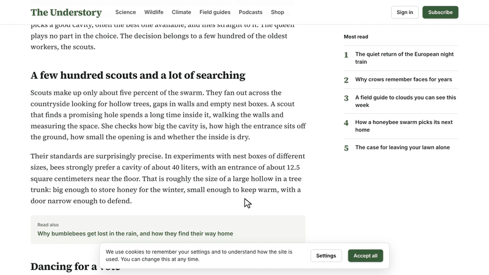

<p align="center">
  <a href="https://shmidtqq65.github.io/distill/">
    <picture>
      <source srcset="assets/demo.webp" type="image/webp">
      
    </picture>
  </a>
</p>

<h1 align="center">DISTILL</h1>

<p align="center"><b>TL;DR any website. Nothing leaves your browser.</b></p>

<p align="center">
Click it on any article and watch the page boil down. Menus and ads evaporate,<br>
the sentences that matter light up, and a card hands you the main idea, the key points, the numbers and the keywords.
</p>

<p align="center">
  <a href="https://shmidtqq65.github.io/distill/"><b>Try it now</b></a>
  &nbsp;·&nbsp;
  <a href="#install">Install</a>
  &nbsp;·&nbsp;
  <a href="#use">Use</a>
  &nbsp;·&nbsp;
  <a href="#how-it-works">How it works</a>
</p>

<p align="center">
  
  
  
  
</p>

---

## What you get

- **Main idea.** The one sentence that best captures the page, found near the headline and the opening paragraphs and checked against the rest of the text.
- **Key points.** Up to five sentences that cover different sections instead of repeating one paragraph, in the order of the original. Click one and the page scrolls to it, already marked in yellow.
- **Figures.** Percentages, prices, distances, durations and other numbers that carry the story, each with the phrase it belongs to.
- **Keywords.** What the page is about. Click one and every mention lights up; each further click jumps to the next one.
- **Reading time.** How long the page takes to read and how long the summary takes, with a reading speed matched to the page's language (228 words a minute for English).
- **Copy.** The whole summary as text with a link back to the page.
- **Chrome's built-in AI.** Where Chrome can run its on-device model, a second summary in the model's own words, plus a translation of the summary into your language.

While the card is open, the page stays readable: the noise is faded, the filler is dimmed and the key sentences are marked, so you can skim the original in context. Press <kbd>Esc</kbd> and every pixel goes back.

## Install

Pick whichever fits. All four run the same single file.

### 1. Bookmark (Chrome, Edge, Safari, Firefox, Arc, Brave)

1. Open the [demo page](https://shmidtqq65.github.io/distill/).
2. Drag the yellow **distill** label into your bookmarks bar. No bar? <kbd>Ctrl</kbd>+<kbd>Shift</kbd>+<kbd>B</kbd>, or <kbd>⌘</kbd>+<kbd>Shift</kbd>+<kbd>B</kbd> on a Mac.
3. Open any article and click the bookmark. Click it again (or press <kbd>Esc</kbd>) to put the page back.

GitHub can't render `javascript:` links in a README, so the label lives on the demo page. To create the bookmark by hand, make a new bookmark and paste the contents of [`bookmarklet.txt`](bookmarklet.txt) as its address. The whole engine is inside the bookmark (about 59,000 characters, under Firefox's 65,536 limit), so it also works on sites with a strict Content Security Policy.

On a phone, copy the code from the demo page, bookmark any page, then edit that bookmark: name it `distill` and paste the code as its address. To run it, type `distill` in the address bar and tap the bookmark.

### 2. Chrome extension (Chrome, Edge, Brave, Arc)

1. Download this repository (**Code → Download ZIP**) and unzip it.
2. Open `chrome://extensions` and switch on **Developer mode**.
3. Click **Load unpacked** and pick the `extension` folder.
4. Click the flask icon on any page, or press <kbd>Alt</kbd>+<kbd>Shift</kbd>+<kbd>D</kbd>. Press it again to put the page back. You can change the shortcut at `chrome://extensions/shortcuts`.

### 3. Userscript

With Tampermonkey or Violentmonkey installed, open the [raw userscript](https://raw.githubusercontent.com/shmidtqq65/distill/main/userscript/distill.user.js) and confirm the install. Then press <kbd>Alt</kbd>+<kbd>Shift</kbd>+<kbd>D</kbd> on any page.

### 4. Console

Open DevTools on any page, paste the contents of [`distill.min.js`](distill.min.js) into the console and press Enter. Chrome and Firefox may ask you to type `allow pasting` first.

## Use

| Input | What it does |
| --- | --- |
| Click a point or the main idea | Scroll to that sentence on the page and flash it |
| Click a figure | Scroll to the sentence with that number |
| Click a keyword | Highlight every mention; click again for the next one |
| <kbd>1</kbd> to <kbd>5</kbd> | Jump to a key point |
| <kbd>C</kbd> | Copy the summary |
| <kbd>H</kbd> or the eye icon | Show the page as it is, keep the card |
| AI / Quotes | Switch between Chrome's summary and the exact sentences (when Chrome's AI is available) |
| Translate | Translate the summary into your browser's language (Chrome 138+) |
| <kbd>Esc</kbd> or × | Close the card and restore the page |

The card is in English. The summary itself stays in the language of the page.

## Chrome's built-in AI

DISTILL works without any AI: the offline engine reads any language, on any browser, on phones too. On top of that it uses [Chrome's Summarizer API](https://developer.chrome.com/docs/ai/summarizer-api) when it is available:

- Chrome or Edge 138 or later on Windows 10/11, macOS 13+, Linux or a Chromebook Plus.
- The page is in English, Spanish, Japanese, German or French.
- About 22 GB of free disk space for the model, and either a GPU with more than 4 GB of memory or 16 GB of RAM.

If the model is already on your computer, the AI summary appears next to the quotes on its own. If it isn't, the card offers a button, because the first run downloads the model and DISTILL never starts that download without asking. The model runs on your device, so the page still goes nowhere. The [Translator API](https://developer.chrome.com/docs/ai/translator-api) works the same way: when a page is in a different language from your browser, the card shows a **Translate** button.

## How it works

DISTILL is one dependency-free script (`src/distill.js`, about 58 KB minified).

- **Finding the article.** Every visible block of text votes for its containers: long paragraphs count in their favor, links, menus, share bars, related stories and comment threads count against them. The container with the best balance becomes the article, and it grows to include the headline when that costs little. Everything outside it is the noise that evaporates.
- **Sentences in any language.** `Intl.Segmenter` splits the text into sentences and words with the rules of the page's language, including Chinese and Japanese. Abbreviations like "e.g." and "Dr." don't end sentences.
- **Ranking.** Sentences become TF-IDF vectors over light stems and are ranked with TextRank over an inverted index. The score also rewards sentences that share words with the headline, open a paragraph or mention the top keywords, and penalizes questions, very short fragments and sentences that lean on the one before ("This", "However"). Key points are then picked with maximal marginal relevance, so they cover different sections.
- **No DOM rewrites.** The marker, the dimming and the keyword highlights use the [CSS Custom Highlight API](https://developer.mozilla.org/docs/Web/API/CSS_Custom_Highlight_API): ranges of text are painted without splitting or wrapping a single node, so React, Vue and other frameworks keep running underneath. The marker sweep is a range that grows letter by letter.
- **Exact restore.** Faded elements get temporary inline styles through a ledger that remembers the original value of every property it touches and puts back the original `style` attribute, character for character. The test suite checks that the markup and the screenshot after <kbd>Esc</kbd> are identical to the ones before.
- **Strict CSP friendly.** No `eval`, no `innerHTML`, no remote code, no network requests. The card lives in a shadow root with a constructed stylesheet.

### Browser support

| Browser | Status |
| --- | --- |
| Chrome, Edge 138+ | Everything, including Chrome's AI and translation |
| Chrome, Edge, Brave, Arc 105+ | Everything except the AI summary |
| Safari 17.2+ | Everything except the AI summary |
| Firefox 140+ | Everything except the AI summary |
| Older browsers | The card works; the page is not marked |

### Privacy

No analytics, no storage, no servers. The script reads the page in your tab, draws the card in the same tab and forgets everything when you press <kbd>Esc</kbd> or reload. Chrome's AI and translator run on your device. The demo site loads no third-party scripts or fonts.

## Development

```bash
npm install          # terser for the build, playwright for the tests
npm run build        # src/distill.js -> distill.min.js, bookmarklet.txt, extension/, userscript/
npm test             # headless checks on the fixture pages, a strict CSP, a phone and a mocked Chrome AI
npm run demo         # renders demo.mp4, assets/demo.webp and assets/demo.gif frame by frame (needs ffmpeg)
```

Once it runs, the engine exposes a small API on `window.__distill`:

| Call | Does |
| --- | --- |
| `result()` | The summary as data: title, language, main idea, points, figures, keywords, reading time |
| `jump(i)` | Scroll to point `i` (`-1` is the main idea) |
| `keyword(i)` | Highlight keyword `i`, or move to its next mention |
| `toggle()` | Close with the animation (same as <kbd>Esc</kbd>) |
| `stop()` | Restore instantly, no animation |
| `state()` | Phase, particles, highlights, AI status |

Options can be set before the script loads through `window.__DS_OPTIONS`, for example `{ ai: false, translate: false, motion: false, credit: false, lang: 'en' }`. Pages can pick the card's fonts with the CSS variables `--distill-sans` and `--distill-serif`. Setting `window.__DS_MANUAL = true` stops the animation loop so tests can drive frames with `step(dt)`.

```
distill/
├── index.html            demo page (GitHub Pages)
├── demo/                 a sample long read to try it on
├── distill.min.js        built engine
├── bookmarklet.txt       built bookmarklet
├── src/distill.js        readable source
├── extension/            Chrome extension (Manifest V3)
├── userscript/           Tampermonkey / Violentmonkey script
├── scripts/              build and demo recorder
├── test/                 smoke test and fixture pages
└── assets/               demo media, icon, fonts
```

The sample magazine "The Understory" is fictional. Its article retells published research on honeybee swarms by Thomas D. Seeley and colleagues.

## License

MIT © 2026 [shmidt](https://x.com/shmidtqq). Made by [@shmidtqq](https://x.com/shmidtqq). Fonts in `assets/fonts` and `test/fonts` are under the SIL Open Font License.

If it saves you a long read, share the card and tag me.
